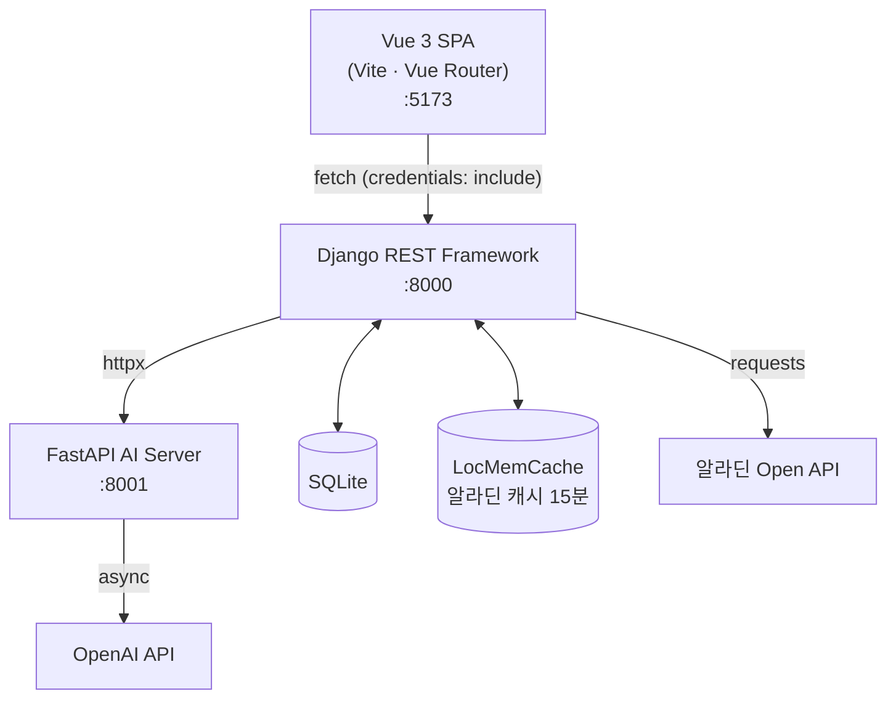

# Arctic
> AI 기반 도서 분석 및 창작 지원 커뮤니티 서비스

<br>

## 목차

- [Arctic](#arctic)
  - [목차](#목차)
  - [A. 팀원 정보 및 업무 분담 내역](#a-팀원-정보-및-업무-분담-내역)
  - [B. 목표 서비스 및 실제 구현 정도](#b-목표-서비스-및-실제-구현-정도)
    - [목표 서비스](#목표-서비스)
    - [실제 구현 정도](#실제-구현-정도)
  - [C. 핵심 기능 설명](#c-핵심-기능-설명)
    - [도서 리뷰 및 평점](#도서-리뷰-및-평점)
    - [위시리스트](#위시리스트)
    - [커뮤니티](#커뮤니티)
    - [선호도 기반 도서 추천](#선호도-기반-도서-추천)
    - [AI 리뷰 감상 분석](#ai-리뷰-감상-분석)
    - [AI 창작 지원](#ai-창작-지원)
  - [D. 생성형 AI 활용 부분](#d-생성형-ai-활용-부분)
  - [E. 서비스 아키텍처](#e-서비스-아키텍처)
  - [F. 데이터베이스 모델링 (ERD)](#f-데이터베이스-모델링-erd)
  - [G. 서비스 URL](#g-서비스-url)
  - [H. 기타 기록](#h-기타-기록)
    - [기술적 의사결정](#기술적-의사결정)
      - [\[재현\] FastAPI AI 서버 분리 도입](#재현-fastapi-ai-서버-분리-도입)
      - [\[재현, 성웅\] 장르 테이블 정규화](#재현-성웅-장르-테이블-정규화)
      - [\[성웅\] 선호도 기반 추천 알고리즘 설계 — RandomForest 기반 머신러닝](#성웅-선호도-기반-추천-알고리즘-설계--randomforest-기반-머신러닝)
      - [\[준성\] 알라딘 API 폴백 검색 결과 직접 반환](#준성-알라딘-api-폴백-검색-결과-직접-반환)
      - [\[재현\] AI 창작 지원 대화형 수정 — history 배열 전파](#재현-ai-창작-지원-대화형-수정--history-배열-전파)
      - [\[전체\] 도서 데이터 관리 전략 — 사전 적재 vs ISBN 기반 온디맨드](#전체-도서-데이터-관리-전략--사전-적재-vs-isbn-기반-온디맨드)
      - [\[재현\] AI 창작 지원 품질 향상 — 구조화 프롬프트 + 장문 응답 전략](#재현-ai-창작-지원-품질-향상--구조화-프롬프트--장문-응답-전략)
      - [\[재현\] AI 창작 지원 가드레일 및 대화형 정보 수집 구조 도입](#재현-ai-창작-지원-가드레일-및-대화형-정보-수집-구조-도입)
    - [트러블슈팅](#트러블슈팅)
      - [\[준성\] 모델 테이블명 불일치로 인한 팀 간 DB 충돌](#준성-모델-테이블명-불일치로-인한-팀-간-db-충돌)
      - [\[재현\] JWT 토큰 보관 — sessionStorage 사용](#재현-jwt-토큰-보관--sessionstorage-사용)
      - [\[준성\] 알라딘 검색 결과 — 클릭한 책만 DB에 저장](#준성-알라딘-검색-결과--클릭한-책만-db에-저장)
  - [Git 협업 규칙](#git-협업-규칙)
    - [브랜치 전략](#브랜치-전략)
    - [브랜치 목록](#브랜치-목록)
    - [커밋 메시지 규칙](#커밋-메시지-규칙)
  - [후기](#후기)
    - [재현](#재현)
    - [성웅](#성웅)
    - [준성](#준성)
  - [기술 스택](#기술-스택)
  - [실행 방법](#실행-방법)
    - [Backend](#backend)
    - [AI Server](#ai-server)
    - [Frontend](#frontend)


---

## A. 팀원 정보 및 업무 분담 내역

| 이름 | 역할 | 담당 |
|---|---|---|
| 박재현 | 팀장 | infra, full-stack, ai |
| 문성웅 | 팀원 | full-stack, ai |
| 박준성 | 팀원 | full-stack, ai |

---

## B. 목표 서비스 및 실제 구현 정도

### 목표 서비스

알라딘 Open API 기반 도서 데이터, AI 기반 감상 분석 및 창작 지원, 유저 간 커뮤니티 기능을 제공한다.

### 실제 구현 정도

| 기능 | 구현 여부 | 비고 |
|---|---|---|
| 회원가입 / 로그인 | ✅ | |
| 도서 목록 / 상세 | ✅ | |
| 리뷰 CRUD + 좋아요 | ✅ | |
| 위시리스트 | ✅ | |
| 팔로우 / 팔로잉 | ✅ | |
| 선호도 기반 도서 추천 | ✅ | 규칙 기반 |
| 커뮤니티 스레드 CRUD | ✅ | |
| 댓글 CRUD | ✅ | |
| AI 리뷰 감상 분석 | ✅ | FastAPI + OpenAI |
| AI 창작 지원 | ✅ | FastAPI + OpenAI |
| 도서 목록 페이지네이션 | ✅ | 검색 결과 포함 |
| 창작 기록 저장 | ✅ | |
| 서비스 배포 | | 차후 진행 |

---

## C. 핵심 기능 설명

### 도서 리뷰 및 평점

도서 상세 페이지에서 별점(1~5)과 텍스트 리뷰를 작성할 수 있다.
한 유저당 한 책에 리뷰 하나만 작성 가능하며, 수정과 삭제는 본인만 가능하다.
다른 유저의 리뷰에 좋아요를 누를 수 있고, 평균 평점은 리뷰 작성/수정/삭제 시 자동으로 갱신된다.

---

### 위시리스트

읽고 싶은 책을 위시리스트에 저장할 수 있다.
도서 상세 페이지에서 토글 방식으로 추가/제거하며, 프로필 페이지에서 전체 목록을 확인할 수 있다.

---

### 커뮤니티

자유롭게 글을 올리고 소통할 수 있는 스레드 기반 커뮤니티를 제공한다.

- **스레드:** 제목과 본문으로 구성. 로그인 유저만 작성 가능하며 본인 글만 수정/삭제 가능
- **댓글:** 스레드에 댓글 작성. 본인 댓글만 수정/삭제 가능
- **좋아요:** 스레드에 좋아요 토글. 본인 글에는 좋아요 불가

---

### 선호도 기반 도서 추천

유저의 리뷰, 위시리스트, 컬렉션, 팔로잉 반응을 피처로 변환해 scikit-learn RandomForest 모델로 추천 점수를 산출한다.

- **분류 모델 3개**: 위시리스트 담을 확률 / 컬렉션 담을 확률 / 긍정 리뷰(4점 이상) 확률
- **회귀 모델 1개**: 예상 평점 예측 (유저 평균 대비 선호 강도로 보정)
- **최종 점수**: 네 예측값을 가중 합산 (긍정반응 25%, 예상평점 20%, 위시 20%, 컬렉션 15%, 팔로잉반응 10%, 작가선호 10%)
- 리뷰가 부족한 신규 유저는 규칙 기반 점수로 폴백
- 이미 리뷰·위시리스트·컬렉션에 담은 책은 후보에서 제외
- 하루 1권 '오늘의 추천'과 피드용 12권을 별도로 제공

추천 모델과 사용자별 상위 50권은 미리 계산해 저장한다. 최초 `runserver`
실행 시 모델 파일이나 추천 캐시가 없으면 한 번 자동 구축하며, 이후 추천
API는 저장된 캐시만 조회한다.

```bash
# 모델 재학습 + 책 통계/사용자 선호/추천 캐시 전체 재생성
python manage.py train_recommendation_models

# 모델은 유지하고 책 통계/사용자 선호/추천 캐시 전체 갱신
python manage.py train_recommendation_models --cache-only

# 저장된 모델로 전체 사용자 추천 캐시 갱신
python manage.py rebuild_recommendations

# 특정 사용자 추천 캐시만 갱신
python manage.py rebuild_recommendations --user-id 1
```

리뷰·위시리스트·컬렉션·선호 장르·팔로우가 변경되면 영향받은 사용자만
백그라운드에서 다시 계산한다.

브라우저 개발자 도구의 추천 API 응답 헤더에서
`X-Recommendation-Cache: HIT`와 `Server-Timing` 처리 시간을 확인할 수
있다. 자동 구축을 끄려면 `.env`에 `RECOMMENDATION_AUTO_BOOTSTRAP=0`을
설정한다.

---

### AI 리뷰 감상 분석

도서 상세 페이지에서 리뷰 3개 이상일 때 "AI 감상 분석" 버튼이 활성화된다.
해당 도서의 전체 리뷰를 FastAPI AI 서버로 전달하고, OpenAI API를 통해 분석한다.

- 긍정/부정/중립 비율
- 독자들이 공통으로 언급한 키워드 5개
- 전체 독자 반응 한줄 요약

---

### AI 창작 지원

장르, 키워드 입력 후 세 가지 탭 중 선택한다.

- **아이디어 발상:** 단편소설 아이디어 3개 제안
- **플롯 제안:** 입력한 아이디어를 기승전결 구조로 구성
- **문장 교정:** 텍스트 교정 결과 + 개선점 설명

로그인 유저의 경우 결과를 저장해 마이페이지에서 다시 볼 수 있다.

---

## D. 생성형 AI 활용 부분

| 기능 | 활용 방식 | 처리 위치 |
|---|---|---|
| 리뷰 감상 분석 | 전체 리뷰 텍스트 → 감정 분석 + 키워드 추출 + 요약 | FastAPI async |
| 아이디어 발상 | 장르 + 키워드 → 아이디어 3개 생성 | FastAPI async |
| 플롯 제안 | 아이디어 → 기승전결 구성 | FastAPI async |
| 문장 교정 | 입력 텍스트 → 교정 + 개선점 | FastAPI async |
| 데이터 생성 | 테스트를 위한 데이터 생성 | 생성형 AI |

---

## E. 서비스 아키텍처



---

## F. 데이터베이스 모델링 (ERD)

```mermaid
erDiagram
    USER {
        int id PK
        string email
        string username
        text bio
        string profile_image
        datetime created_at
    }
    FOLLOW {
        int id PK
        int from_user_id FK
        int to_user_id FK
        datetime created_at
    }
    USER_GENRE {
        int id PK
        int user_id FK
        int genre_id FK
    }
    GENRE {
        int id PK
        string name
    }
    BOOK {
        int id PK
        string title
        string author
        string publisher
        string isbn
        text description
        string cover_image
        date published_date
        float average_rating
    }
    BOOK_STAT {
        int id PK
        int book_id FK
        float average_rating
        int review_count
        int wishlist_count
        int collection_count
        datetime updated_at
    }
    BOOK_GENRE {
        int id PK
        int book_id FK
        int genre_id FK
    }
    REVIEW {
        int id PK
        int user_id FK
        int book_id FK
        text content
        int rating
        datetime created_at
    }
    REVIEW_LIKE {
        int id PK
        int user_id FK
        int review_id FK
    }
    WISHLIST {
        int id PK
        int user_id FK
        int book_id FK
        datetime created_at
    }
    COLLECTION {
        int id PK
        int user_id FK
        int book_id FK
        datetime created_at
    }
    THREAD {
        int id PK
        int user_id FK
        string title
        text content
        datetime created_at
    }
    COMMENT {
        int id PK
        int user_id FK
        int thread_id FK
        text content
        datetime created_at
    }
    THREAD_LIKE {
        int id PK
        int user_id FK
        int thread_id FK
    }
    COMMENT_LIKE {
        int id PK
        int user_id FK
        int comment_id FK
    }
    AI_WRITING_DRAFT {
        int id PK
        int user_id FK
        string title
        string draft_type
        string genre
        string keywords
        json content
        bool is_public
        datetime created_at
    }
    AI_WRITING_LOG {
        int id PK
        int user_id FK
        string request_type
        text input_text
        text output_text
        datetime created_at
    }
    AI_CREATION_LIKE {
        int id PK
        int user_id FK
        int draft_id FK
        datetime created_at
    }
    AI_CREATION_COMMENT {
        int id PK
        int user_id FK
        int draft_id FK
        text content
        datetime created_at
    }
    AI_CREATION_COMMENT_LIKE {
        int id PK
        int user_id FK
        int comment_id FK
        datetime created_at
    }
    DAILY_BOOK_RECOMMENDATION {
        int id PK
        int user_id FK
        int book_id FK
        date recommendation_date
        json scores
        json candidate_sources
        datetime created_at
    }
    USER_PREFERENCE {
        int id PK
        int user_id FK
        float average_rating
        json genre_weights
        json liked_genres
        json disliked_genres
        json genre_average_ratings
        json genre_rating_counts
        json author_weights
        json author_average_ratings
        json author_rating_counts
        datetime updated_at
    }
    RECOMMENDATION_CACHE {
        int id PK
        int user_id FK
        int book_id FK
        int rank
        float score
        json scores
        json reasons
        string model_version
        datetime updated_at
    }
    RECOMMENDATION_STATE {
        int id PK
        int user_id FK
        bool is_dirty
        string dirty_reason
        datetime last_built_at
        datetime updated_at
    }

    USER ||--o{ FOLLOW : "from_user"
    USER ||--o{ FOLLOW : "to_user"
    USER ||--o{ USER_GENRE : ""
    USER ||--o{ REVIEW : ""
    USER ||--o{ REVIEW_LIKE : ""
    USER ||--o{ WISHLIST : ""
    USER ||--o{ COLLECTION : ""
    USER ||--o{ THREAD : ""
    USER ||--o{ COMMENT : ""
    USER ||--o{ THREAD_LIKE : ""
    USER ||--o{ COMMENT_LIKE : ""
    USER ||--o{ AI_WRITING_DRAFT : ""
    USER ||--o{ AI_WRITING_LOG : ""
    USER ||--o{ AI_CREATION_LIKE : ""
    USER ||--o{ AI_CREATION_COMMENT : ""
    USER ||--o{ AI_CREATION_COMMENT_LIKE : ""
    USER ||--o{ DAILY_BOOK_RECOMMENDATION : ""
    USER ||--|| USER_PREFERENCE : ""
    USER ||--o{ RECOMMENDATION_CACHE : ""
    USER ||--|| RECOMMENDATION_STATE : ""

    GENRE ||--o{ USER_GENRE : ""
    GENRE ||--o{ BOOK_GENRE : ""

    BOOK ||--o{ BOOK_GENRE : ""
    BOOK ||--|| BOOK_STAT : ""
    BOOK ||--o{ REVIEW : ""
    BOOK ||--o{ WISHLIST : ""
    BOOK ||--o{ COLLECTION : ""
    BOOK ||--o{ DAILY_BOOK_RECOMMENDATION : ""
    BOOK ||--o{ RECOMMENDATION_CACHE : ""

    REVIEW ||--o{ REVIEW_LIKE : ""

    THREAD ||--o{ COMMENT : ""
    THREAD ||--o{ THREAD_LIKE : ""

    COMMENT ||--o{ COMMENT_LIKE : ""

    AI_WRITING_DRAFT ||--o{ AI_CREATION_LIKE : ""
    AI_WRITING_DRAFT ||--o{ AI_CREATION_COMMENT : ""

    AI_CREATION_COMMENT ||--o{ AI_CREATION_COMMENT_LIKE : ""
```



---

## G. 서비스 URL

추후 배포 후 업데이트 예정

---

## H. 기타 기록


### 기술적 의사결정

---

#### [재현] FastAPI AI 서버 분리 도입

**배경:**
AI 기능(리뷰 감상 분석, 창작 지원)을 Django에서 직접 OpenAI API를 호출하는 방식으로 초안을 구성했다.

**문제점:**
OpenAI API 호출은 응답이 수 초 단위로 느리다. AI 호출이 완료되는 동안 Django 워커가 묶여 있으면, 그 사이에 들어오는 일반 API 요청(도서 목록, 리뷰 조회 등)도 대기하게 된다.

**결정:**
AI 추론 전용 서버를 FastAPI로 분리한다. Django는 AI 요청을 FastAPI에 위임한 뒤 즉시 다른 요청을 처리할 수 있고, FastAPI는 async/await 기반으로 오래 걸리는 AI 호출 여러 건을 동시에 처리한다. Django는 FastAPI 서버에 내부 HTTP 요청을 보내는 방식으로 통신한다.

**트레이드오프:**
서버가 두 개로 분리되어 로컬 실행 시 Django(8000), FastAPI(8001) 두 포트를 동시에 띄워야 하고, 서버 간 통신 오류에 대한 예외 처리가 추가로 필요하다.

**결과:**
Django 메인 서버의 응답성을 보호하면서 AI 기능을 독립적으로 운영할 수 있는 구조가 되었다.

---

#### [재현, 성웅] 장르 테이블 정규화

**배경:**
초기 설계에서 Book 모델의 genre 필드를 CharField 문자열로 저장하는 방안을 검토했다. 유저 관심 장르도 User 모델에 쉼표 구분 문자열로 저장하는 방식이었다.

**문제점:**
- 장르 기반 추천 쿼리 시 문자열 contains 매칭으로 정확도가 낮음
- 한 책이 여러 장르에 속하는 경우 표현 불가
- 유저가 여러 관심 장르를 선택할 때 집계/필터 쿼리가 복잡해짐(원자성 문제)

**결정:**
GENRE 독립 테이블 + BOOK_GENRE(M:N) + USER_GENRE(M:N) 중간 테이블로 정규화한다.

**트레이드오프:**
알라딘 API의 categoryName이 "국내도서>소설/시/희곡>한국소설" 형태의 계층형 문자열로 제공된다. fixture 수집 시 파싱 + 표준화 기준을 팀이 사전 합의해야 하는 추가 작업이 발생한다.

**결과:**
장르 기반 추천 쿼리가 JOIN으로 명확하게 표현 가능해졌고, 추천 알고리즘의 정확도와 유지보수성이 향상되었다.

---

#### [성웅] 선호도 기반 추천 알고리즘 설계 — RandomForest 기반 머신러닝

**배경:**
초기 규칙 기반 3단계 폴백(팔로우 → 선호 장르 → 인기순)으로 구현했으나, 유저 행동의 세부 맥락(작가 기피, 장르별 평점 강도, 팔로잉의 소셜 반응 등)을 반영하지 못하는 한계가 있었다.

**결정:**
scikit-learn RandomForest를 도입해 유저·도서 상호작용을 16개 피처로 수치화하고 모델 4개를 학습한다.

- **분류 3개** (RandomForestClassifier): 위시리스트 담을 확률, 컬렉션 담을 확률, 긍정 리뷰(4점+) 확률
- **회귀 1개** (RandomForestRegressor): 예상 평점 (유저 평균 대비 선호 강도 보정)
- 최종 점수 = 네 예측값을 가중 합산
- 리뷰가 부족한 신규 유저는 규칙 기반 점수로 자동 폴백

**트레이드오프:**
추천 요청마다 모델을 즉시 재학습하므로 사용자 수가 많아지면 응답 지연이 발생할 수 있다.

**결과:**
장르·작가 선호 강도, 팔로잉의 소셜 반응, 리뷰 신뢰도를 함께 반영하는 개인화 추천이 가능해졌다.

**후속 개선 ([재현]):**
실시간 재학습 방식의 응답 지연 한계를 해결하기 위해 precompute 방식으로 전환했다. 모델 학습과 사용자별 상위 50권 추천 결과를 미리 계산해 DB에 저장하고, 이후 추천 API는 캐시만 조회해 응답한다. 리뷰·위시리스트·팔로우 등 데이터 변경 시 해당 사용자의 캐시만 백그라운드에서 갱신한다.

---

#### [준성] 알라딘 API 폴백 검색 결과 직접 반환

**배경:**
DB에 없는 책을 검색하면 알라딘 API를 호출해 저장한 뒤, 저장된 결과를 반환하는 폴백 로직을 구현했다.

**문제점:**
최초 구현에서는 알라딘 API 호출 후 저장한 다음, DB에 다시 `icontains` 쿼리를 날려 결과를 반환했다. 그런데 알라딘이 반환하는 제목에 공백이 포함되는 경우(예: 검색어 "클린코드" → 저장된 제목 "클린 코드")가 있어 재조회 시 매칭 실패, 빈 배열 반환.

**해결 방법:**
저장 후 재조회를 없애고 `update_or_create`가 반환한 Book 객체 리스트를 직접 반환하는 방식으로 변경했다.

```python
aladin_books = search_and_save_books(search)
if aladin_books:
    serializer = BookListSerializer(aladin_books, many=True)
    return Response(serializer.data)
```

**트레이드오프:**
같은 키워드로 재검색하면 DB에 저장된 제목과 icontains가 불일치할 경우 다시 알라딘 API를 호출한다. 검색 횟수가 늘 수 있으나, 알라딘 일일 호출 한도(5000회) 안에서 운영 규모상 문제없다고 판단.

**결과:**
검색어와 저장 제목 간 공백 차이에 무관하게 항상 결과를 반환하게 되었다.

---

#### [재현] AI 창작 지원 대화형 수정 — history 배열 전파

**배경:**
아이디어 발상, 플롯 제안, 문장 교정은 단발성 요청으로 구현되어 있었다. "두 번째 아이디어를 더 어둡게 바꿔줘"처럼 이전 AI 응답을 기반으로 후속 수정하는 기능이 필요했다.

**결정:**
FastAPI 요청 모델에 `history: list[Message] = []` 필드를 추가하고, Django views에서 `request.data.get('history', [])`를 그대로 FastAPI에 전달한다. 클라이언트가 이전 대화 내역을 쌓아서 보내는 구조.

```python
# Django views.py
history = request.data.get('history', [])
response = _proxy_to_ai('/generate_ideas', {'genre': genre, 'keywords': keywords, 'history': history})

# FastAPI main.py
if history:
    messages.extend({"role": m.role, "content": m.content} for m in history)
```

**트레이드오프:**
히스토리가 길어질수록 OpenAI에 전달되는 토큰이 늘어나 응답 시간이 증가하고 비용이 늘 수 있다. 클라이언트가 히스토리를 직접 관리해야 하므로 프론트 구현 복잡도가 약간 높아진다.

**결과:**
서버 측 세션 없이 클라이언트 주도로 대화 맥락을 유지할 수 있는 stateless 구조가 되었다.

---

#### [전체] 도서 데이터 관리 전략 — 사전 적재 vs ISBN 기반 온디맨드

**배경:**
초기 설계에서 알라딘 API로 1000권을 사전에 수집해 DB에 적재하고, 서비스는 내부 DB만 사용하는 방식을 검토했다.

**문제점:**
- 사전 적재한 도서 외에는 서비스 불가 — 유저가 원하는 책이 없을 수 있음
- 실제로 조회되지 않는 책까지 DB에 쌓여 불필요한 데이터 증가
- 알라딘 데이터 갱신(표지, 설명 등) 시 DB와 불일치 발생 가능

**결정:**
ISBN을 unique key로 사용하는 **온디맨드** 방식을 채택한다.
유저가 책을 검색하면 알라딘 API를 실시간 호출하고, `get_or_create`로 DB에 없으면 저장, 있으면 그냥 반환한다.
리뷰, 위시리스트 등 유저 데이터는 모두 내부 DB의 Book 레코드에 연결된다.

**트레이드오프:**
알라딘 API 호출 횟수 제한(5000회)이 있어, 검색마다 무조건 호출하면 한도 초과 위험이 있다.
이를 방지하기 위해 내부 DB를 먼저 검색하고, 결과가 없을 때만 알라딘 API를 호출하는 구조로 호출을 최소화한다.
SSAFY 요구사항(fixture 50개)을 충족하기 위해 초기 50권은 스크립트로 사전 적재한다.

**결과:**
알라딘 전체 도서를 서비스할 수 있는 구조가 되었고, 실제로 검색된 책만 DB에 쌓여 데이터 효율성이 높아졌다.

---

#### [재현] AI 창작 지원 품질 향상 — 구조화 프롬프트 + 장문 응답 전략

**배경:**
초기 AI 창작 지원 기능은 아이디어 발상과 플롯 제안 결과가 한두 문단 수준으로 생성되어 실제 창작 과정에 활용하기 어려웠다. 아이디어의 깊이, 인물 설정, 갈등 구조가 부족해 AI가 생성한 결과물이 단순 요약문처럼 보이는 문제가 있었다.

**문제점:**

* 아이디어가 지나치게 짧아 후속 창작에 활용하기 어려움
* 등장인물, 배경, 갈등 구조 등 핵심 서사 요소가 누락됨
* 플롯 제안이 기승전결 구조만 형식적으로 갖추고 실제 장면 구성이 부족함

**결정:**
모델 변경이나 RAG 도입 대신 프롬프트 엔지니어링을 우선 적용했다.

* `generate_ideas` : 아이디어당 500자 이상 생성
* 제목, 인물, 배경, 핵심 갈등, 주요 장면 포함 강제
* `suggest_plot` : 기승전결 각 단계 300자 이상 생성
* 장면 묘사, 감정 변화, 행동, 대사 포함 지시

**트레이드오프:**
응답 길이가 길어지면서 토큰 사용량과 응답 시간이 증가한다. 또한 생성 결과의 품질은 향상되지만 API 비용도 함께 증가한다.

**결과:**
단순 아이디어 나열이 아닌 실제 소설 기획서 수준의 결과를 생성할 수 있게 되었고, 사용자가 추가 수정과 확장을 진행할 수 있는 기반이 마련되었다.

---

#### [재현] AI 창작 지원 가드레일 및 대화형 정보 수집 구조 도입

**배경:**
AI 창작 지원 기능이 일반 챗봇처럼 사용될 가능성이 있었다. 또한 사용자가 제공하는 정보가 부족하면 AI가 생성하는 이야기의 개성과 완성도가 떨어지는 문제가 있었다.

**문제점:**

* 음식 추천, 고민 상담 등 창작과 무관한 요청 유입 가능
* 정보 부족 시 AI 특유의 평면적인 이야기 생성
* 사용자가 원하는 분위기나 경험을 충분히 반영하기 어려움

**결정:**
AI 서버에 창작 전용 가드레일을 추가하고, 별도의 질문 생성 엔드포인트를 도입했다.

* 시스템 프롬프트에서 창작 관련 요청만 허용
* 창작과 무관한 요청은 오류 응답 반환
* `/ask_story_seeds` 엔드포인트 추가

**트레이드오프:**
일반 챗봇 기능을 포기하는 대신 서비스 목적에 집중하게 된다. 또한 사용자 입력 단계가 추가되어 생성까지의 과정이 다소 길어진다.

**결과:**
서비스 정체성을 창작 지원으로 명확하게 제한할 수 있게 되었으며, 사용자의 경험과 감정을 반영한 보다 개성 있는 이야기 생성이 가능해졌다.

---

### 트러블슈팅


#### [재현] precompute 전환 과정 — 서버 기동 블로킹

**문제 상황:**
precompute 방식으로 전환하면서 `runserver` 최초 실행 시 모델 파일이나 추천 캐시가 없으면 자동으로 초기 구축을 시작하도록 구현했다. 그런데 구축 작업이 메인 스레드에서 동기 실행되어 완료될 때까지 서버가 요청을 못 받는 블로킹 상태가 됐다. 브라우저에서 접속하면 완전히 연결이 안 됐고, 모델 구축이 끝날 때까지 수십 초에서 수 분간 서버가 먹통이었다.

**원인 분석:**
`apps.py`의 `ready()` 훅에서 구축 함수를 동기 호출 → Django 초기화 전에 메인 스레드가 묶임

**해결 방법:**
`threading.Thread(daemon=True)`로 구축 작업을 백그라운드 스레드에 위임했다.

```python
# ai/apps.py
thread = threading.Thread(target=bootstrap_recommendations, daemon=True)
thread.start()
```

**결과:**
`runserver` 실행 즉시 서버가 기동되어 요청을 처리할 수 있다. 추천 캐시는 백그라운드에서 구축되며, 캐시가 아직 없는 경우 규칙 기반 폴백으로 응답한다.

---

#### [재현] 백그라운드 추천 갱신과 일반 요청의 SQLite 잠금 충돌

**문제 상황:**
서버 기동 블로킹을 백그라운드 스레드로 해결한 뒤, 새로운 문제가 발생했다. 백그라운드 스레드가 추천 캐시를 갱신하는 도중 사용자가 리뷰 작성, 위시리스트 추가 등 DB 쓰기가 필요한 기능을 사용하면 `database is locked` 오류가 발생했다. 사용자 입장에선 이유 없이 기능이 안 되는 것처럼 느껴졌다.

**원인 분석:**
SQLite 기본 저널 모드(Rollback Journal)는 쓰기 시 DB 전체에 배타 잠금을 걸어 다른 모든 읽기·쓰기를 차단한다.

| 상황 | WAL 미적용 (기본) | WAL 적용 후 |
|---|---|---|
| 쓰기 중 읽기 요청 | 잠금 대기(차단) | 허용 (동시 읽기 가능) |
| 쓰기 중 쓰기 요청 | `database is locked` 즉시 오류 | 최대 20초 대기 후 재시도 |
| 백그라운드 갱신 + API 동시 쓰기 | 요청 실패 | 정상 처리 |

**해결 방법:**
`settings.py`에 WAL 모드와 20초 타임아웃을 추가했다.

```python
# artic/settings.py
'OPTIONS': {
    'timeout': 20,
    'init_command': 'PRAGMA journal_mode=WAL;',
}
```

**결과:**
백그라운드 갱신과 일반 API 요청이 동시에 DB에 접근해도 잠금 오류 없이 처리된다.

---

#### [재현] 추천 다양성 부족 — 취향 가중치 편향 및 오늘의 1권 반복

**문제 상황:**
두 가지 문제가 겹쳐 추천이 사실상 2권만 번갈아 표시됐다.

1. **개인 취향 가중치 편향**: 장르·작가 선호도 반영 비중이 낮아 사용자와 무관하게 비슷한 인기 도서 위주로 추천이 수렴했다.
2. **오늘의 1권 반복**: "어제 추천한 책을 제외하고 예상 별점이 가장 높은 1권"을 선정하는 방식이었는데, 추천 순위가 하루 사이에 거의 바뀌지 않아 1위 → 2위 → 1위 → 2위를 무한 반복하는 문제가 발생했다.

**해결 방법:**
- 개인 취향(장르·작가 선호도) 가중치를 상향하고 신간 주입 비율을 축소해 개인화 강도를 높였다.
- 오늘의 1권 선정 방식을 **날짜 + 유저 ID 시드**로 상위 20권에서 점수 가중 추첨으로 변경했다. 날짜가 바뀌면 시드가 달라져 매일 다른 책이 선정된다.

**결과:**
사용자별로 다른 추천 결과가 나오고, 오늘의 1권이 매일 자연스럽게 회전해 반복 현상이 해소됐다.

---

#### [재현] 회원가입 빈칸 미검증

**문제 상황:**
회원가입 폼에서 필수 항목을 일부 비워도 가입이 완료되는 문제가 있었다.

**원인 분석:**
프론트엔드 유효성 검사에만 의존하고 서버 측 검증이 누락된 상태여서, 폼 검사를 우회하거나 직접 API 호출 시 빈칸으로 가입이 가능했다.

**해결 방법:**
백엔드 serializer에서 필수 필드 검증을 추가하고, 프론트엔드에서도 빈칸 제출을 막는 검증을 강화했다.

**결과:**
모든 필수 항목을 채우지 않으면 서버에서 오류를 반환해 가입이 진행되지 않는다.

---

#### [준성] 모델 테이블명 불일치로 인한 팀 간 DB 충돌

**문제 상황:**
팀원 간 병합 후 Django 마이그레이션을 실행했을 때 테이블명이 서로 달라 DB 구조가 통일되지 않는 문제가 발생했다. 예를 들어 `Book` 모델의 테이블명이 ERD 상에는 `BOOK`이지만, 실제로는 Django 자동 생성 규칙에 따라 `books_book`으로 생성되었다.

**원인 분석:**
Django는 `Meta.db_table`을 지정하지 않으면 `앱이름_모델명` 형식(소문자)으로 테이블명을 자동 생성한다. ERD에서 정의한 테이블명(`BOOK`, `FOLLOW`, `USER_GENRE` 등)과 다르기 때문에 팀원마다 다른 테이블명으로 DB가 생성되어 충돌이 발생했다.

**해결 방법:**
각 모델의 `Meta` 클래스에 `db_table`을 명시적으로 지정하여 ERD 테이블명과 일치시켰다.

```python
class Book(models.Model):
    ...
    class Meta:
        db_table = 'BOOK'
```

**결과:**
모든 팀원의 DB 테이블명이 ERD 기준으로 통일되어 병합 후에도 일관된 스키마가 유지되었다.

---

#### [재현] JWT 토큰 보관 — sessionStorage 사용

**배경:**
로그인 상태를 어느 시점까지 유지할지 결정이 필요했다. localStorage를 쓰면 창을 닫아도 토큰이 남아 영구 로그인이 되고, 별도의 만료 관리가 필요하다.

**결정:**
JWT access 토큰을 sessionStorage에 저장한다. sessionStorage는 브라우저 창/탭이 닫히면 자동으로 초기화되므로, 창을 껐다 켜면 자연스럽게 로그인이 풀린다.

**트레이드오프:**
새 탭을 열거나 창을 닫으면 로그인 상태가 유지되지 않아 다시 로그인해야 한다.

**결과:**
별도의 로그아웃 없이 창을 닫는 것만으로 세션이 종료되는 단순한 인증 흐름이 되었다.

---

#### [준성] 알라딘 검색 결과 — 클릭한 책만 DB에 저장

**배경:**
초기 구현에서는 알라딘 API 검색 결과 전체를 DB에 저장했다. 유저가 실제로 관심을 보이지 않은 책까지 저장되어 불필요한 데이터가 쌓이는 문제가 있었다.

**결정:**
검색 결과는 저장 없이 목록만 화면에 보여주고, 유저가 특정 책을 클릭해 상세 페이지에 진입하는 시점에 해당 책 1권만 `POST /books/materialize/`로 DB에 저장한다.

**트레이드오프:**
상세 페이지를 새로고침하면 아직 저장되지 않은 책은 재진입이 필요할 수 있다.

**결과:**
실제 유저가 관심을 보인 책만 DB에 저장되어 데이터 효율이 높아졌고, 불필요한 알라딘 API 저장 호출도 줄었다.


---

## Git 협업 규칙

### 브랜치 전략
- `master`: 항상 동작하는 상태 유지, 직접 push 금지
- `이름/기능명`: 기능 개발 브랜치

### 브랜치 목록

| 브랜치명 | 용도 | 담당 |
|---|---|---|
|  jaehyeon/docs | README, 요구사항 명세서 등 문서 작업 | 박재현 |
|  jaehyeon/add | ai 서버 구현 | 박재현 |
|  jaehyeon/fix | 버그, 로직 수정 | 박재현 |
|  seongung | account 앱 구현 | 문성웅 |
|  seongung/FE | 프론트엔드 구현 | 문성웅 |
|  junseong | books, community 앱 구현, 프론트엔드 구현 | 박준성 |
|  ai/profile/fix | 버그, 로직 수정 | 박준성 |

### 커밋 메시지 규칙
- `add`: 새 기능 추가
- `fix`: 버그 수정
- `delete`: 기능 삭제
- `docs`: 문서 수정

예시: `add: 도서 목록 API 구현 260622`

---

## 후기

### 재현

**새로 배운 것**
- Fast API를 활용한 AI 서버를 만들어 Django와 통신하는 방식으로 비동기 방식의 서버 운영에 대해 배웠다. RPC API 방식 대해서도 새로 배웠다.
- AI를 활용하는 부분에 프롬프트 엔지니어링을 통해 서비스의 목적에 맞는 답변을 만들 수 있게 하였고 방법에 대한 요령을 배울 수 있었다.
- 프런트엔드 UI를 만들면서 figma와 비슷한 claude design을 사용하여, UI의 세세한 부분들을 직접 지도하며 기본 틀을 만들어 개발하였고 효과적인 방법이었다.
- 프로젝트 리딩을 맡아 Git Flow 기반 협업, 태스크 관리, MVP 중심의 점진적 개발 프로세스를 경험했다.

**느낀점**
- 프로젝트 리딩을 했지만 나도 개발 협업 경험이 많지 않아 처음에 어려운 부분이 많이 있었지만 팀원들이 잘 도와줘서 마무리를 잘 할 수 있었다.
- 팀원이 본의 아니게 3명이 되어 덕분에 Git Flow 전략을 사용한 형상관리를 잘 경험할 수 있어서 값진 경험이었다.

### 성웅

**새로 배운 것**
- 프론트엔드를 처음부터 구현하면서 반응형 상태 관리와 컴포넌트 설계 방식을 익혔다.
- DRF에서 커스텀 인증 클래스를 직접 작성하고, JWT 기반 인증 흐름 전반을 이해하게 됐다.
- 프론트와 백엔드를 함께 담당하면서 API 응답 구조가 화면 구현에 미치는 영향을 직접 체감했다.
- scikit-learn RandomForest로 도서 추천 모델을 구현하면서, 피처 엔지니어링과 학습 데이터 구성 방법을 실습했다.

**느낀점**
- 처음 Vue를 다루다 보니 초반에 컴포넌트 구조를 잡는 데 시간이 걸렸지만, 반복하다 보니 패턴이 보이기 시작했다.
- 머신러닝을 실서비스에 붙여보는 게 처음이었는데, 모델 성능보다 데이터 구조와 피처 설계가 더 중요하다는 걸 실감했다.

### 준성

**새로 배운 것**
- 알라딘 Open API를 연동하면서 외부 API 폴백 전략과 응답 정규화 방법을 배웠다.
- 검색 결과를 즉시 저장하지 않고 사용자 액션 시점에만 저장하는 지연 저장 구조를 설계하면서 DB 설계와 API 흐름을 함께 고민하는 경험을 했다.
- 무한 스크롤 API를 구현하고, Vue에서 "더 보기" 방식으로 붙이는 흐름을 경험했다.
- 팔로우/팔로잉 관계와 같은 자기참조 관계 테이블 설계 및 쿼리 작성을 경험했다.

**느낀점**
- 기능을 단순히 동작시키는 것보다 실제 사용 흐름을 고려해 데이터 저장 시점을 설계하는 것이 더 어렵다는 걸 느꼈다.
- 백엔드와 프론트를 같이 보니 서로 어떻게 연결되는지 구체적으로 이해할 수 있어서 좋았다.


## 기술 스택

**Backend**


**Frontend**


**DB**


> 현재 SQLite로 구현. 추후 PostgreSQL로 전환 예정.

**외부 API**


**협업**


---

## 실행 방법

### Backend
```bash
cd BE

python -m venv venv
source venv/bin/activate  # Windows: venv\Scripts\activate
pip install -r requirements.txt

# .env 파일 설정 (.env.example 참고)
# SECRET_KEY, AI_SERVER_URL, ALADIN_TTB_KEY 입력

python manage.py migrate

# 더미 데이터 생성 (장르·책 947권·유저 51명·리뷰/위시리스트/컬렉션/커뮤니티 포함)
python manage.py seed_dummy_library

python manage.py runserver
```

> 데이터 양을 줄이고 싶다면: `python manage.py seed_dummy_library --reviews-per-user 10 --threads-per-user 1 --comments-per-thread 2`  
> 초기화 후 재생성: `python manage.py seed_dummy_library --reset`  
> 더미 유저 계정: `user00@ssafy.com` ~ `user50@ssafy.com` / 비밀번호: `ssafy`

### AI Server
```bash
cd AI

python -m venv venv
source venv/bin/activate  # Windows: venv\Scripts\activate
pip install -r requirements.txt
uvicorn main:app --reload --port 8001
```

### Frontend
```bash
cd FE/arctic
npm install
npm run dev
```
